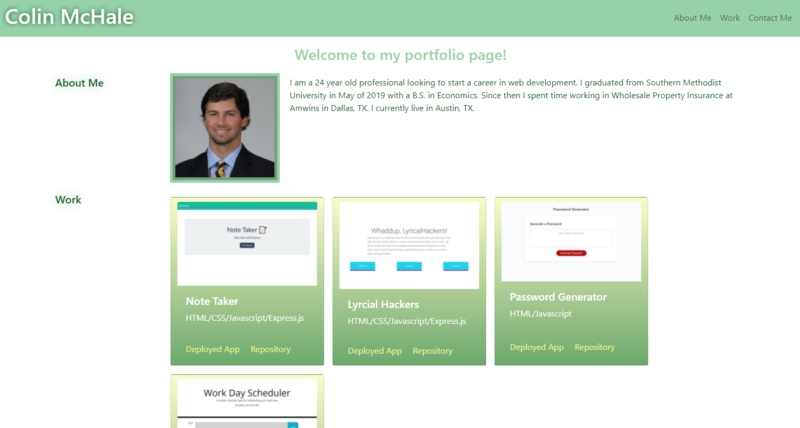

# My Portfolio Page

In this repository, you will find my code building a portfolio page that contains the following sections: Header, About Me, Work, and a Contact Me. The purpose for this page is to display my web development skills through the projects/applications I have made. This will become an essential tool to have as I dive into a new career.

## Sections:

* Header - includes name in a decorative format, a working navigation bar that when activated will move to specific locations throughout the page, and a styled background with proper spacing between elements.

* About Me - contains a header that has proper indentation, an image of myself that has multiple borders, and a brief description.

* Work - this section displays the projects in a row with the first projects growing twice as fast as the others. Each project has a link over the figure. Each project is designed with a gradient background and in a card-like manner.

* Contact Me - includes a header with proper indentation along with multiples sections of info (one being a link to a seperate tab).

### Preview

### Link to Deployed Site
[Click Here](https://colinmchale.github.io/MyPortfolioPage/).
    